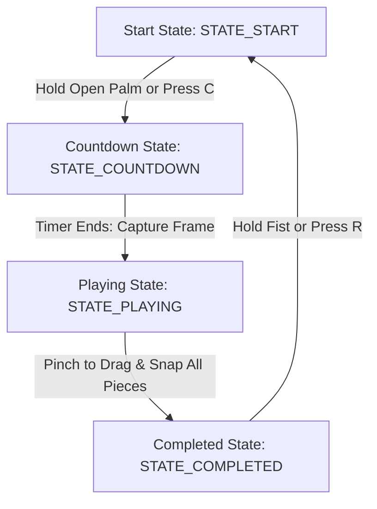

# 🧩 AI Hand Tracking Puzzle Game

An interactive, computer-vision-powered puzzle game built with **Python**, **OpenCV**, and **MediaPipe Hands**. Play using real-time webcam video feed and intuitive hand gestures—drag, drop, and snap puzzle pieces with physical pinches in mid-air! No mouse or keyboard required.

---

## 📖 Table of Contents
1. [Core Features](#-core-features)
2. [How it Works & Gameplay Loop](#-how-it-works--gameplay-loop)
3. [Gesture Control Scheme](#-gesture-control-scheme)
4. [Keyboard Overrides](#-keyboard-overrides)
5. [Codebase Structure](#-codebase-structure)
6. [Installation & Setup](#-installation--setup)
7. [Running the Application](#-running-the-application)
8. [Configuration & Customization](#-configuration--customization)
9. [Technical Architecture](#-technical-architecture)
10. [Troubleshooting & Diagnostics](#-troubleshooting--diagnostics)
11. [License](#-license)

---

## ✨ Core Features

*   **Real-time Hand Landmark Tracking:** Leverages MediaPipe's sub-millisecond hand tracking model to locate 21 distinct hand skeleton points.
*   **Holographic Skeleton Overlay:** Displays a modern, color-coded cyan/green/purple glowing overlay highlighting knuckles, joints, and fingertips on a mirrored camera stream.
*   **Webcam Photo Capture:** Position yourself, hold up an open palm to start a 3-second visual countdown, and capture a fresh image directly from your camera.
*   **Dynamic Grid Slicing:** Automatically segments the captured image into an $N \times N$ puzzle grid (supports easy 2x2, standard 3x3, hard 4x4, etc.).
*   **Robust Physics Snapping:** Interactive pieces snap smoothly to their designated cells when released within a configurable pixel tolerance.
*   **Heads-Up Display (HUD):** Features a translucent, high-contrast overlay that indicates frame rate (FPS), state info, puzzle progress, and current active gestures.
*   **System Permissions Diagnostics:** Embedded error-handling panel providing clear debugging advice for camera hardware permissions and multiple camera index configurations.

---

## 🔄 How it Works & Gameplay Loop

The game operates on a robust finite state machine (FSM) consisting of four states:



1.  **STATE_START (Align & Capture):**
    The screen shows your live mirrored camera feed with a dashed center crop preview area. An interactive "HOW TO PLAY" panel guides you. Align the camera subject inside the box.
2.  **STATE_COUNTDOWN:**
    Triggered by holding an **Open Palm** for 1.2s or pressing `C`. A large circular yellow/cyan radial countdown timer (3.. 2.. 1) appears.
3.  **STATE_PLAYING:**
    The camera takes a snapshot at 0, slices the cropped section into grid blocks, randomizes their positions on the left side of the screen, and renders a faint preview of the target solution board on the right side. You pinch pieces to drag and drop them onto the target board.
4.  **STATE_COMPLETED (Victory!):**
    Once all pieces snap into their correct spots, a premium victory card overlay appears. To start over, hold a **Fist** for 1.2s or press `R`.

---

## ✋ Gesture Control Scheme

Interact with the game using these precise, real-time hand gestures tracked from your webcam:

| Gesture | Graphic Trigger | Visual Feedback | Action in Game |
| :--- | :--- | :--- | :--- |
| **Open Palm** | Index, middle, ring & pinky fingers extended | Orange/Cyan radial countdown ring around cursor | **Hold for 1.2s:** Starts the 3-second camera countdown (Start state) |
| **Pinch** | Thumb-to-index distance below ~40% of palm size (distance-invariant, with hysteresis) | Active green connection line and green cursor ring | **Hold and drag:** Grabs and drags the puzzle piece beneath the cursor |
| **Point** | Only index finger extended, others closed | Orange dual cursor rings | Hover and explore pieces without triggering actions |
| **Fist** | All fingers completely closed | Orange/Cyan radial progress ring around cursor | **Hold for 1.2s:** Reshuffles pieces (Playing state) or Resets game (Completed state) |
| **None / Neutral**| Any other posture | White cursor dot | Default hover tracking |

---

## ⌨️ Keyboard Overrides

In case of webcam detection issues or for rapid testing, standard keyboard overrides are mapped directly to game functions:

*   **`C` / `c`:** Force capture image and start puzzle countdown (works in Start State).
*   **`S` / `s`:** Reshuffle and randomize unplaced pieces (works in Playing State).
*   **`R` / `r`:** Hard reset the puzzle board and return to Start State.
*   **`Q` / `q` / `Esc`:** Safely close webcam stream and exit the application.

---

## 📁 Codebase Structure

```
python_hand_tracking_puzzle/
├── app.py                # Contains config, models, gesture detectors, and game rendering engine
├── requirements.txt      # List of dependencies required to run the game
├── README.md             # Detailed guide and project documentation
└── venv/                 # Virtual environment (ignored by Git)
```

*   **`app.py`:** The entire application is self-contained in a single, high-performance module, divided into logical objects (`Config`, `PuzzlePiece`, `GestureDetector`, and `PuzzleGame`).
*   **`requirements.txt`:** Lists standard python packages (`mediapipe`, `opencv-python`, and `numpy`).

---

## ⚙️ Installation & Setup

### Prerequisites
*   **Python 3.10** or **3.11** (highest compatibility with MediaPipe binaries).
*   A functional built-in webcam or external USB camera.

### Step-by-Step Installation

#### 🍎 macOS / 🐧 Linux
1.  **Clone or navigate to the directory:**
    ```bash
    cd python_hand_tracking_puzzle
    ```
2.  **Create a clean virtual environment:**
    ```bash
    python3 -m venv venv
    ```
3.  **Activate the virtual environment:**
    ```bash
    source venv/bin/activate
    ```
4.  **Install dependencies:**
    ```bash
    pip install --upgrade pip
    pip install -r requirements.txt
    ```

#### 🪟 Windows
1.  **Navigate to the directory:**
    ```cmd
    cd python_hand_tracking_puzzle
    ```
2.  **Create a virtual environment:**
    ```cmd
    python -m venv venv
    ```
3.  **Activate the virtual environment:**
    ```cmd
    venv\Scripts\activate
    ```
4.  **Install dependencies:**
    ```cmd
    pip install --upgrade pip
    pip install -r requirements.txt
    ```

---

## 🚀 Running the Application

To run the game, activate your virtual environment and execute:

```bash
python app.py
```

---

## 🔧 Configuration & Customization

The game is designed to be fully customizable. You can adjust the difficulty, pinch sensitivity, webcam index, and visual boundaries directly in [app.py](file:///Users/tansaphea/Documents/5.%20Persional/AI%20Porject/AI%20Hand%20Tracking/python_hand_tracking_puzzle/app.py) by editing the variables inside the `Config` class:

```python
class Config:
    # Screen Resolution Settings
    WINDOW_WIDTH = 1280
    WINDOW_HEIGHT = 720
    
    # Board Settings
    BOARD_SIZE = 450
    GRID_SIZE = 3               # <-- Set to 2 (easy 2x2), 3 (normal 3x3), or 4 (hard 4x4)
    
    # Gesture & Game Physics Sensitivity
    PINCH_ENGAGE_RATIO = 0.40   # <-- Pinch starts below this thumb-index / palm-size ratio
    PINCH_RELEASE_RATIO = 0.60  # <-- Pinch ends above this ratio (hysteresis stops flicker)
    SNAP_DISTANCE = 40          # <-- Distance (pixels) to automatically snap a piece
    GESTURE_HOLD_DURATION = 1.2 # <-- Hold duration (seconds) to trigger fist/open palm actions
    GESTURE_STABLE_FRAMES = 3   # <-- Frames a new gesture must persist before it registers
    RELEASE_GRACE_SEC = 0.15    # <-- Keep dragging through tracking dropouts this long

    # Landmark smoothing (velocity-adaptive): lower MIN = steadier cursor when still
    SMOOTHING_MIN_ALPHA = 0.25
    SMOOTHING_MAX_ALPHA = 0.90

    # MediaPipe Hands confidence thresholds
    DETECTION_CONFIDENCE = 0.6  # <-- Higher values reduce false hands but require good lighting
    TRACKING_CONFIDENCE = 0.6
    
    # Camera hardware configurations
    CAMERA_INDEX = 0            # <-- Try 1, 2, or -1 if using external webcams
```

---

## 🛠️ Technical Architecture

The program relies on four core software components:

### 1. `Config`
Stores system settings, visual coordinates, game difficulty parameters, and hardware configuration.

### 2. `PuzzlePiece`
A lightweight dataclass that maintains the source image block, correct board coordinate slots (`correct_x`, `correct_y`), current drag coordinates (`current_x`, `current_y`), and status markers (`is_placed`).

### 3. `GestureDetector`
Wraps MediaPipe Hands. It extracts a list of $x, y$ landmark pixel coordinates scaled to the target resolution. It includes:
*   **Distance Formulas:** Uses Euclidean distance calculations to measure proximity between the thumb tip (landmark 4) and index tip (landmark 8) for pinch gestures.
*   **Finger Extension Scans:** Uses coordinate comparisons between joint segments to count extended fingers (distinguishing Fist, Point, Open Palm).
*   **Stateful Hold Timers:** Integrates a duration tracker that allows users to perform long-press gestures (Fist and Open Palm) without instant accidental activation.

### 4. `PuzzleGame`
The main rendering and state loop coordinator. It:
*   Initializes the OpenCV `VideoCapture` object.
*   Performs horizontal mirror flips on raw frame buffers to match natural human motion.
*   Crops and slices camera inputs using NumPy array slicing without copy operations.
*   Manages drag-and-drop mechanics (detects which piece is clicked by reversing coordinate lists, ensuring foreground pieces are grabbed first, and clamps pieces to prevent dragging them off-screen).
*   Implements clean double-buffered translucent overlays using OpenCV weighted blending overlays (`cv2.addWeighted`).

---

## 🩺 Troubleshooting & Diagnostics

### 🔴 Problem 1: Window opens with "CAMERA ACCESS ERROR"
*   **Reason:** Camera hardware is busy, blocked, or not detected.
*   **Solution:**
    1. Check if Zoom, MS Teams, Discord, or web browsers are using your webcam and close them.
    2. Check privacy configurations:
        *   **macOS:** Open *System Settings -> Privacy & Security -> Camera*. Ensure permissions are enabled for your Terminal application, IDE, or VS Code.
        *   **Windows:** Open *Settings -> Privacy & security -> Camera*. Confirm that *Camera access* and *Let desktop apps access your camera* are enabled.
    3. Modify `Config.CAMERA_INDEX` in `app.py`. Try setting it to `1`, `2`, or `-1`.

### 🟡 Problem 2: Gestures lag or skeleton lines stutter
*   **Reason:** High CPU utilization or outdated system libraries.
*   **Solution:**
    *   Connect your machine to a power source (especially laptops) as computer vision algorithms are highly resource-demanding.
    *   Close CPU-heavy background applications.
    *   Lower detection parameters in `Config`: set `DETECTION_CONFIDENCE` and `TRACKING_CONFIDENCE` to `0.5` or `0.6` to speed up MediaPipe inference.

### 🔵 Problem 3: Difficult to pinch or drag pieces
*   **Reason:** Hand is too far away from the webcam, or lighting conditions are poor.
*   **Solution:**
    *   Pinch detection is now normalized by palm size, so camera distance matters much less. If pinching is still hard, raise `Config.PINCH_ENGAGE_RATIO` (e.g. `0.40` to `0.45`).
    *   If pieces drop mid-drag, raise `Config.PINCH_RELEASE_RATIO` (e.g. `0.60` to `0.70`) or `Config.RELEASE_GRACE_SEC`.
    *   Ensure the hand is well-lit and stands out from background noise.

### 🟢 Problem 4: Pieces snap too early or fail to snap
*   **Reason:** The snap distance is too large or too small.
*   **Solution:**
    *   Decrease `Config.SNAP_DISTANCE` (e.g. to `20` or `25`) for a tighter, more precise snapping challenge.
    *   Increase `Config.SNAP_DISTANCE` (e.g. to `55` or `60`) to make placing pieces easier.

---

## 📄 License
This project is licensed under the MIT License - see the LICENSE file for details.
